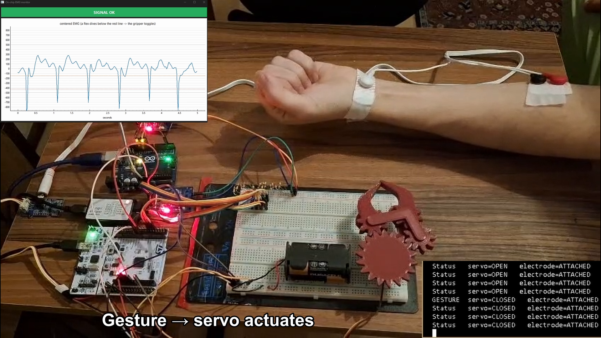
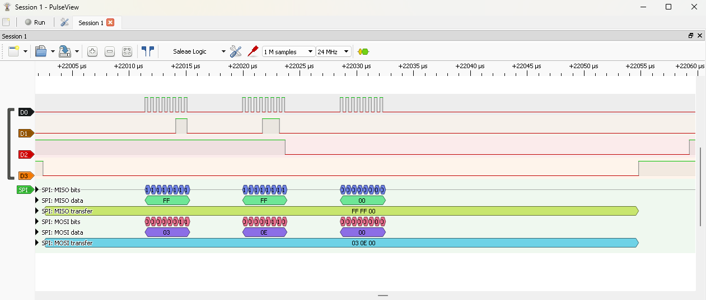
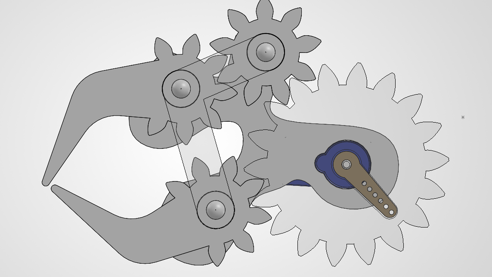
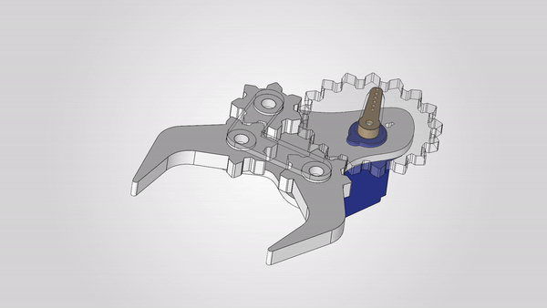

# STM32 Myoelectric Gripper

A self-contained myoelectric gripper on real STM32 firmware: it reads a forearm muscle, **classifies the gesture on-chip in real time**, drives a gripper, **reports its state over a CAN bus**, and **fails safe**. A rebuild of my M.Sc. prosthetic-hand thesis on industrial-grade firmware (STM32 + FreeRTOS + CAN).

**Stack:** STM32F446 (Cortex-M4F) | FreeRTOS | CAN (MCP2515, hand-written register-level driver) | on-chip DSP + classification | timer + DMA sensing | IWDG safety | PlatformIO + GitHub Actions CI

<!-- INLINE VIDEO: on GitHub, edit this README in the web UI and DRAG docs/demo_video_STM32.mp4 into the
     editor right here. GitHub uploads it and inserts a player link that plays inline. Then delete the
     image-link line below (or keep it as a fallback). -->
[](https://github.com/user-attachments/assets/aa81c4aa-91ec-4cf5-a480-a131216e033e)

▶ **[Watch the ~30s demo](docs/demo_video_STM32.mp4)**: flex → gripper actuates → state broadcast over CAN, plus the fail-safe (pull an electrode, the gripper holds).

---

## What it demonstrates

| Capability | How, in this project |
|---|---|
| Real-time firmware on STM32 | HAL/CMSIS via PlatformIO (`framework = stm32cube`) |
| RTOS | FreeRTOS: 4 tasks + queues + priorities ([`src/main.cpp`](src/main.cpp)) |
| CAN bus | Hand-written, register-level MCP2515-over-SPI driver ([`Mcp2515CanBus.h`](src/Mcp2515CanBus.h) / [`Mcp2515Registers.h`](src/Mcp2515Registers.h)), verified two-node |
| On-chip DSP | 50 Hz mains-rejection notch ([`Notch.h`](src/Notch.h)) |
| On-chip classification | Baseline tracking + dip detector, at 1 kHz in the ADC/DMA ISR ([`MuscleTrigger.h`](src/MuscleTrigger.h)) |
| Closed-loop actuation | Slew-limited servo from the classified gesture ([`Servo.h`](src/Servo.h)) |
| Safety / failsafe | Signal-loss hold + IWDG watchdog + watchdog-starvation reboot ([`Watchdog.h`](src/Watchdog.h)) |
| Sensing | Timer-triggered ADC + DMA at 1 kHz, zero CPU per sample ([`Emg.h`](src/Emg.h)) |
| Tooling | PlatformIO, GitHub Actions CI, logic-analyzer protocol decode |

The hard biosignal part (single-channel sEMG classification on a microcontroller) comes from my published thesis; this project adds the industrial-firmware layer (RTOS, CAN, safety) around it.

---

## Architecture

The board is autonomous: the muscle drives everything, the laptop is only a viewer.


Why the decision lives in the **ISR**: the muscle is sampled at 1 kHz by hardware (TIM2 → ADC → DMA), and the lightweight detector runs per-sample in the DMA-complete callback, so a flex is caught immediately and handed to the tasks through FreeRTOS queues (`xQueueSendFromISR`). The **watchdog task is the lowest priority on purpose**: if any higher task hangs, it never runs, never pets the IWDG, and the chip reboots itself.

File-by-file map: [`FIRMWARE_MAP.md`](FIRMWARE_MAP.md).

---

## The CAN work

There is **no mature MCP2515 driver for STM32 + stm32cube**, so the driver is **written from the datasheet** by hand: the SPI instruction set and register map live in [`Mcp2515Registers.h`](src/Mcp2515Registers.h) (each constant carries its datasheet name), and the logic in [`Mcp2515CanBus.h`](src/Mcp2515CanBus.h). It was brought up in four verified steps:

1. **Reach the chip over SPI**, reset + read `CANSTAT` back (`0x80` = Configuration mode).
2. **Configure + go live**, set the bit timing (8 MHz crystal @ 500 kbps) and switch to Normal mode.
3. **Loopback frame**, build a frame, transmit it internally, read it back (no bus needed).
4. **Two-node transmit**, send real frames over `CANH/CANL` to a separate node.

In the running firmware the gripper broadcasts a 2-byte payload `[gripper closed?, electrode attached?]` as an **immediate gesture frame** (`0x100`) on each flex and a **status heartbeat** (`0x101`) otherwise.

It's verified end-to-end by an **independent second node**: an Arduino + MCP2515 receives the frames and prints them ([`bench/arduino_can_node/`](bench/arduino_can_node/)). Note the deliberate contrast: that node uses an off-the-shelf library, while the STM32 side is the hand-written driver.

| Logic-analyzer capture | |
|---|---|
|  | The STM32 driving the MCP2515 over SPI, decoded live in PulseView. |

**Bus note:** the bench CAN bus is short and was initially **unterminated** (measured ~25 kΩ across CANH/CANL, transceiver impedance only), which produced occasional auto-retransmissions (CAN's reliability doing its job). Adding termination across CANH/CANL cleaned it up. A production harness uses 120 Ω at each end (60 Ω total).

---

## Hardware & wiring

| Part | Role |
|---|---|
| ST Nucleo-F446RE | STM32F446RE, Cortex-M4F, FPU + DSP, onboard ST-LINK (Mini-USB) |
| Grove EMG detector | analog EMG envelope → ADC (PA0) |
| MCP2515 module | CAN controller + transceiver, driven over SPI2 |
| TowerPro SG90 servo | gripper actuation (PB6 / TIM4), separate 6 V supply, shared ground |
| 24 MHz USB logic analyzer | SPI/CAN protocol decode (oscilloscope substitute for digital) |

Pin map and power notes: [`docs/wiring.md`](docs/wiring.md) | board pinout: [`docs/STM32_NUCLEO_F446RE_Pinout.png`](docs/STM32_NUCLEO_F446RE_Pinout.png) | parts list: [`docs/BOM.md`](docs/BOM.md).

---

## Mechanical

The gripper is a 3D-printed geared mechanism I designed in SolidWorks, so this is a full-stack
mechatronics project: mechanism, electronics, and firmware.

<p>
  
  
</p>

### [Rotate the assembled gripper in 3D &rarr;](cad/gripper_assembly.stl)

GitHub opens `.stl` files in an interactive 3D viewer, click the heading above to spin the model.

- Printable parts (6 STLs): [`cad/print_parts/`](cad/print_parts/)
- Gear math (module, tooth count, ratio, backlash): [`docs/gripper_mechanics.md`](docs/gripper_mechanics.md)
- Gear-design tool I wrote to draw the tooth profiles: [`tools/gear_designer/`](tools/gear_designer/)

---

## Build / flash / run

PlatformIO (`framework = stm32cube`), flashes over the onboard ST-LINK.

```bash
pio run                 # build the firmware
pio run -t upload       # flash over ST-LINK (Mini-USB)

# watch the on-chip telemetry live (Python 3.12: numpy, pyserial, PyQt6, pyqtgraph)
python tools/emg_studio/chip_monitor.py --port COM6
```

> **Note on the build:** the FreeRTOS ARM_CM4F port needs the FPU, so the whole image is hard-float. That takes two cooperating pieces, the `build_flags` in [`platformio.ini`](platformio.ini) **and** [`fpu_link.py`](fpu_link.py) (a post-script that forces the link hard-float). Both are required; removing either breaks the link.

CI builds the firmware on every push (`.github/workflows/`).

---

## Repo layout

```
src/                 firmware: one main.cpp + a header-only class per part
  main.cpp           tasks, queues, scheduler, interrupt handlers
  Emg.h              TIM2 -> ADC -> DMA acquisition at 1 kHz
  MuscleTrigger.h    the on-chip brain (baseline, notch, dip detect, failsafe)
  Notch.h            50 Hz biquad notch
  Servo.h            slew-limited gripper PWM
  Comms.h            USB serial telemetry (TX)
  Watchdog.h         IWDG
  Mcp2515CanBus.h    hand-written MCP2515 CAN driver (logic)
  Mcp2515Registers.h the MCP2515 datasheet as code (commands/registers/values)
lib/FreeRTOS/        the kernel (ARM_CM4F port + heap_4)
include/             FreeRTOSConfig.h
bench/arduino_can_node/  the second CAN node used to verify the link
tools/emg_studio/    laptop viewer/logger (chip_monitor.py)
docs/                wiring, captures, demo video, design notes
FIRMWARE_MAP.md      what each file is + the task/queue layout
```

---

## Scope & honest limitations

- **One gesture** (a single muscle "dip" toggles open/close) by design, the multi-grip DTW classifier lives in the thesis; this project's focus is the embedded system around it.
- **CAN bus is a short bench setup** (two nodes, improvised termination), not a production-grade 120 Ω-terminated harness.
- **On-chip DSP is a hand-coded biquad notch** rather than ARM's CMSIS-DSP library; for heavier filtering or FFT work, CMSIS-DSP (which the M4's DSP/FPU is built for) would be the next step.
- **CAN is transmit-only** here (a sensor-actuator node reports its state). Receive + hardware ID filtering would be configured at the controller for a multi-node bus.

---

## Background & contact

This rebuilds the embedded layer of my M.Sc. thesis on single-channel sEMG gesture classification on a microcontroller:

- Journal article (IJANSER, 2024): https://as-proceeding.com/index.php/ijanser/article/view/1728
- Extended arXiv preprint: https://arxiv.org/abs/2504.15256

**Can KADILAR** | embedded / firmware engineer  
Portfolio: [canarchive.com](https://canarchive.com)  
LinkedIn: [can-kadilar](https://www.linkedin.com/in/can-kadilar/)  
Email: kadilarmustafacan@gmail.com
