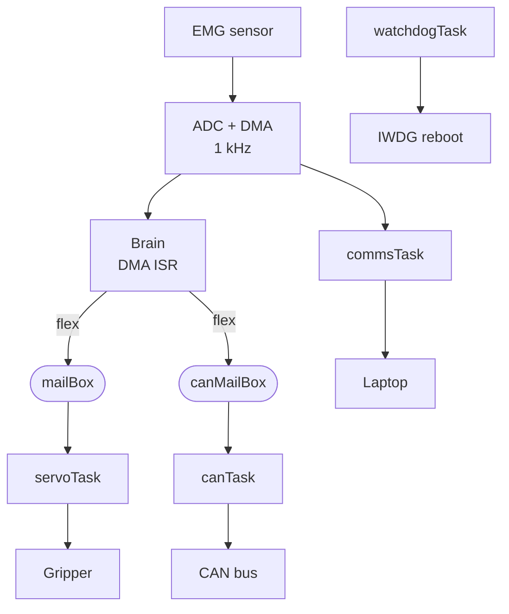

# CAN-Networked Real-Time Myoelectric Gripper Firmware

A self-contained myoelectric gripper on STM32 firmware: it reads a forearm muscle, classifies the gesture on-chip in real time, drives a gripper, reports its state over a CAN bus, and fails safe. It rebuilds the embedded layer of my M.Sc. prosthetic-hand thesis on industrial-grade firmware (STM32, FreeRTOS, CAN).

https://github.com/user-attachments/assets/c445c9bf-50ab-4b18-980c-f69603f6f55b

**~30s demo:** flex, the gripper actuates, the state broadcasts over CAN, then the failsafe (pull an electrode, the gripper holds).

**Tech stack:** STM32F446 (Cortex-M4F), FreeRTOS, CAN (MCP2515, hand-written register-level driver), on-chip DSP and classification, timer and DMA sensing, IWDG watchdog, PlatformIO, GitHub Actions CI

## What this is

The board is autonomous: the muscle drives everything, and the laptop is only a viewer. TIM2 triggers the ADC on the EMG pin at 1 kHz, DMA parks each sample in RAM, and a lightweight detector runs per sample inside the DMA-complete interrupt, so a flex is caught the instant it happens and handed to the FreeRTOS tasks through queues. The tasks drive the gripper, stream telemetry, broadcast state on the CAN bus, and pet the watchdog.

The hard biosignal part (single-channel sEMG gesture detection on a microcontroller) comes from my published thesis. The work here is the industrial-firmware layer around it: a real-time OS, a CAN stack written from the datasheet, on-chip DSP, and a safety layer.

## Highlights

- **One muscle, decided on-chip.** TIM2 to ADC to DMA at 1 kHz with zero CPU per sample; the baseline-tracking dip detector runs in the DMA ISR, so a flex is caught immediately.
- **FreeRTOS with a safety-by-priority design.** Four tasks (servo, comms, CAN, watchdog) with priorities and queue mailboxes. The watchdog task is the lowest priority on purpose: if any higher task hangs, it never runs, never pets the IWDG, and the chip reboots itself.
- **A CAN stack written from the datasheet.** There is no mature MCP2515 driver for STM32 and stm32cube, so the SPI instruction set, register map, and logic are hand-written, brought up in four verified steps, and checked end to end by a second CAN node.
- **On-chip DSP.** A 50 Hz biquad notch rejects mains hum before detection.
- **Fails safe.** A signal-loss hold keeps the current grip if an electrode drops, backed by a hardware IWDG watchdog.
- **A full-stack build.** The gripper is a 3D-printed involute-gear pincer I designed in SolidWorks and drove from a single SG90.

## Architecture

The board is autonomous; the laptop only flashes it and views the trace.



The decision lives in the **interrupt**: `HAL_ADC_ConvCpltCallback` fires at 1 kHz on every DMA sample and runs the detector (baseline, notch, dip), then `xQueueSendFromISR`s a token into both `mailBox` (to servoTask) and `canMailBox` (to canTask). The token's existence is the signal that a flex happened; its value is unused, and the queues do their own locking, so there is no manual volatile or atomic reasoning.

Four tasks run under the scheduler (higher number is more urgent):

1. **servoTask (priority 3):** a token toggles the grip; `servo.ease()` glides toward the target each cycle (slew-limited). The 5 ms receive-timeout also paces it at about 200 Hz.
2. **commsTask (priority 2):** every 20 ms, streams the `raw, centered, valid` trace to the laptop viewer over USART2.
3. **canTask (priority 2):** a token sends an immediate gesture frame (0x100); a 200 ms timeout sends a status heartbeat (0x101). Both carry `[gripper closed?, electrode attached?]`.
4. **watchdogTask (priority 1, lowest):** every 500 ms, pets the IWDG. The low priority is the safety: a hung higher task starves it and the chip reboots.

## The CAN work

There is no mature MCP2515 driver for STM32 and stm32cube, so the driver is written from the datasheet by hand: the SPI instruction set and register map live in [`src/Mcp2515Registers.h`](src/Mcp2515Registers.h) (each constant carries its datasheet name) and the logic in [`src/Mcp2515CanBus.h`](src/Mcp2515CanBus.h). It was brought up in four verified steps:

1. **Reach the chip over SPI**, reset it, and read `CANSTAT` back (`0x80` = Configuration mode).
2. **Configure and go live**: set the bit timing (8 MHz crystal at 500 kbps) and switch to Normal mode.
3. **Loopback frame**: build a frame, transmit it internally, and read it back (no bus needed).
4. **Two-node transmit**: send real frames over `CANH/CANL` to a separate node.

In the running firmware the gripper broadcasts a 2-byte payload `[gripper closed?, electrode attached?]` as an immediate gesture frame (`0x100`) on each flex and a status heartbeat (`0x101`) otherwise. It is verified end to end by an independent second node, an Arduino plus MCP2515 that receives and prints the frames ([`bench/arduino_can_node/`](bench/arduino_can_node/)). That node uses an off-the-shelf library, so the two sides are a deliberate contrast: hand-written driver against a stock one.

| Logic-analyzer capture | |
|---|---|
|  | The STM32 driving the MCP2515 over SPI, decoded live in PulseView. |

**Bus note:** the bench CAN bus is short and was initially unterminated (measured ~25 kΩ across CANH/CANL, transceiver impedance only), which produced occasional auto-retransmissions (CAN's reliability doing its job). Adding termination cleaned it up. A production harness uses 120 Ω at each end (60 Ω total).

## Mechanical

The gripper is a 3D-printed involute-gear pincer I designed in SolidWorks, so this is a full-stack mechatronics build: mechanism, electronics, and firmware.

<p>
  
  
</p>

A single SG90 drives a 28.5° pressure-angle involute spur train (z18 to z9 to z9), a 2:1 step-up to two counter-rotating fingers, giving about 108° of finger sweep in under 0.1 s and about 0.09 N·m per finger (the firmware slew-limits it so it does not slam). The gears were drawn with the in-repo `tools/gear_designer` (DXF export, undercut and bore checks).

### [Rotate the assembled gripper in 3D](cad/gripper_assembly.stl)

GitHub opens `.stl` files in an interactive 3D viewer; click the heading to spin the model. Printable parts are in [`cad/print_parts/`](cad/print_parts/).

## Specs

| Category | Value |
|---|---|
| MCU / board | STM32F446RE (Cortex-M4F, FPU + DSP), ST Nucleo-F446RE |
| RTOS | FreeRTOS, ARM_CM4F port, 4 tasks + 2 queue mailboxes |
| Sensing | TIM2-triggered ADC + DMA at 1 kHz on PA0 |
| On-chip DSP | 50 Hz biquad notch |
| Detection | baseline-tracking dip detector in the DMA ISR |
| CAN | MCP2515 over SPI2, hand-written driver, 8 MHz xtal at 500 kbps |
| Frames | gesture 0x100 + heartbeat 0x101, payload [closed?, electrode?] |
| Actuation | SG90 servo, slew-limited, on TIM4_CH1 (PB6) |
| Gear train | involute z18 to z9 to z9, 2:1 step-up, ~108° finger sweep |
| Safety | signal-loss hold + IWDG hardware watchdog (~2 s) |
| Tooling | PlatformIO (stm32cube, hard-float), GitHub Actions CI |

## Hardware and wiring

| Part | Pin | Notes |
|---|---|---|
| Grove EMG detector | PA0 (A0) | ADC1 analog envelope in |
| SG90 servo | PB6 (D10) | TIM4 channel 1, 50 Hz PWM |
| Serial TX | PA2 | USART2 over the ST-LINK virtual COM port (telemetry is one-way) |
| MCP2515 | SPI2: PB13 SCK, PB14 MISO, PB15 MOSI, PB12 CS, PA9 INT | 8 MHz xtal at 500 kbps |

SPI2 is chosen over SPI1 because SPI1's SCK is PA5, the onboard LED, which would flicker on every SPI clock. The servo runs on a separate 6 V (4xAAA) supply, not the Nucleo 5 V pin (its current spikes brown out the board); tie the servo supply ground to Nucleo GND so the PWM has a common reference. Board pinout: [`docs/STM32_NUCLEO_F446RE_Pinout.png`](docs/STM32_NUCLEO_F446RE_Pinout.png).

## Build, flash, run

PlatformIO (`framework = stm32cube`), flashed over the onboard ST-LINK.

```bash
pio run                 # build the firmware
pio run -t upload       # flash over ST-LINK (Mini-USB)

# watch the on-chip telemetry live (Python 3.12: numpy, pyserial, PyQt6, pyqtgraph)
python tools/emg_studio/chip_monitor.py --port COM6
```

The FreeRTOS ARM_CM4F port needs the FPU, so the whole image is hard-float. That takes two cooperating pieces, the `build_flags` in [`platformio.ini`](platformio.ini) and [`fpu_link.py`](fpu_link.py) (a post-script that forces the link hard-float). Both are required; removing either breaks the link. CI builds the firmware on every push.

## Bill of materials

Parts, sources, and prices (two CAN nodes, so it includes a second MCP2515 and an Arduino): [`BOM.md`](BOM.md).

## Repo structure

```
src/                 firmware: one main.cpp + a header-only class per part
  main.cpp           tasks, queues, scheduler, interrupt handlers, the 1 kHz brain callback
  Emg.h              TIM2 -> ADC -> DMA acquisition at 1 kHz
  MuscleTrigger.h    the on-chip brain (baseline, notch, dip detect, failsafe)
  Notch.h            50 Hz biquad notch
  Servo.h            slew-limited gripper PWM
  Comms.h            USB serial telemetry (TX)
  Watchdog.h         IWDG
  Mcp2515CanBus.h    hand-written MCP2515 CAN driver (logic)
  Mcp2515Registers.h the MCP2515 datasheet as code (commands, registers, values)
lib/FreeRTOS/        the kernel (ARM_CM4F port + heap_4), vendored, unedited
include/             FreeRTOSConfig.h
bench/arduino_can_node/  the second CAN node used to verify the link
tools/emg_studio/    laptop viewer/logger (chip_monitor.py)
tools/gear_designer/ the gear-profile tool used to draw the pincer
cad/                 the gripper assembly STL + printable parts
docs/                captures, CAD renders, board pinout
```

## Known limitations

- **One gesture** (a single muscle dip toggles open/close) by design; the multi-grip DTW classifier lives in the thesis, and this project's focus is the embedded system around it.
- **The CAN bus is a short bench setup** (two nodes, improvised termination), not a production 120 Ω-terminated harness.
- **The on-chip DSP is a hand-coded biquad notch**; for heavier filtering or FFT work, ARM's CMSIS-DSP (which the M4's DSP and FPU are built for) is the next step.
- **CAN is transmit-only** here (a sensor-actuator node reporting its state). Receive plus hardware ID filtering would be configured at the controller for a multi-node bus.

## Background and contact

This rebuilds the embedded layer of my M.Sc. thesis on single-channel sEMG gesture classification on a microcontroller:

- Journal article (IJANSER, 2024): https://as-proceeding.com/index.php/ijanser/article/view/1728
- Extended arXiv preprint: https://arxiv.org/abs/2504.15256

**Ken KADILAR** - embedded / firmware engineer  
Portfolio: [canarchive.com](https://canarchive.com)  
LinkedIn: [ken-kadilar](https://www.linkedin.com/in/ken-kadilar/)  
Email: kenkadilar@gmail.com
